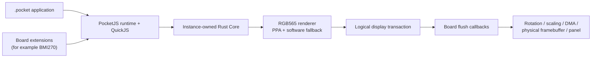
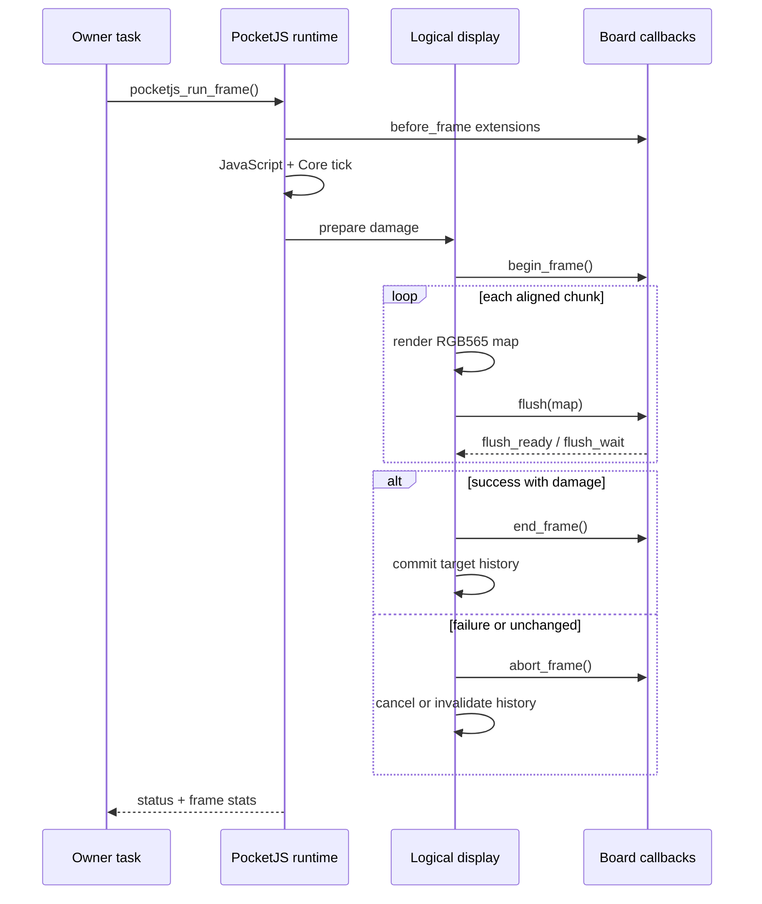

# Architecture

## Ownership boundary

PocketJS-IDF owns the logical side of the frame:

- package validation and native PAK installation;
- QuickJS HostOps and extension callback sequencing;
- instance-owned UI tree, renderer, frame snapshot, and damage history;
- RGB565 rendering and ordered PPA/software operation dispatch;
- halo, alignment, chunking, strip scheduling, commit, and cancellation.

The consumer owns physical presentation:

- display controller and board initialization;
- rotation, scaling, centering, and physical addresses;
- DMA/PPA presentation completion;
- native front/back framebuffer retirement and swap;
- touch, sensors, buttons, and task scheduling.

No Tab5, ST7121/ST7123, MIPI-DSI, DPI, or BMI270 implementation belongs in
this component.

## Frame transaction

Damage history is keyed by the stable target ID returned from
`begin_frame`. This is required for physical double buffering because an
inactive framebuffer may contain content from two presented frames ago.

## Raster path

Opaque rectangles use PPA FILL. ESP-IDF fixed fills are supplied through
expanded `fill_argb_color` channels even when the destination is RGB565;
packed RGB565 fixed-color values are intentionally not used.

Antialiased glyphs, translucent rectangles, and white-alpha corner textures
use A8 BLEND. Compatible opaque PSM5650 textures use SRM. Gradients,
triangles, and unsupported transformations fall back to the software
rasterizer in DrawList order.

## Failure recovery

A flush, wait, or end-frame failure prevents history commit. The current
transaction is aborted, that target history is invalidated, and the next
successful frame is a full redraw. A QuickJS extension error fails only the
current frame; pending exceptions and rejected promises are cleared after
logging.
